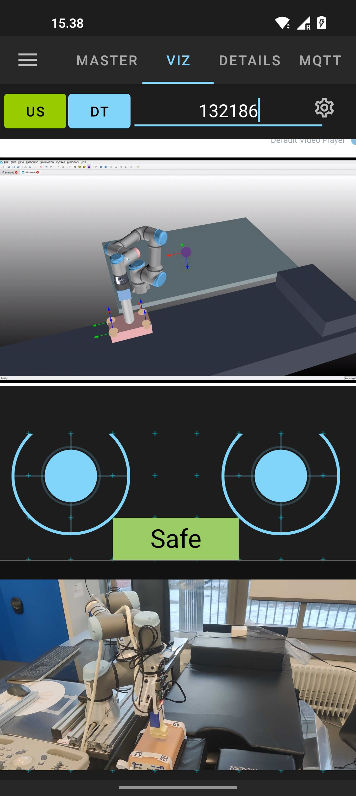

# adhoc-ROS-Mobile

This is an ad-hoc version of the Android application, named ROS-Mobile, for the robot operating system (Rottmann et al, 2020). The ad-hoc app is developed to integrate the capabilities of MQTT clients and ROS nodes on a smartphone.

## Purpose

The purpose of this app is to tele-operate robotics manipulators using two joysticks: one of them is used for XY plane movements while the other one is for controlling the Z axis motion. At the same time, the images from an IP camera can be displayed on the smartphone screen. In this case, we are interested in showing the images captured by the eye-in-hand.

In addition, a new ROS subscriber serves as a traffic light (green, yellow and red) to indicates the forces on the end-effector, where there is an ultrasound camera to perform a medical scanning. 

On the other hand, another space on the screen can show the virtual environment associated with the digital twin of the robot. This visualization is associated with a screen stream from a LAN/WAN socket (IP + port). This same layout can display the images coming from the ultrasound camera attached on the robot tip. The user can switch between both visualizations using two buttons (US for ultrasound scanning and DT for digital twin visualization).

On the other hand, another ROS subscriber, using the camera plugin, is used for displaying the images coming from the assitant's camera. The images of this second camera are published via ROS from another smartphone using the UMA-ROS-Android app.

## Results

The results of this test will be shown on a paper submitted to the Robotics and Automation Letters. 
If the paper is accepted, more explanation will be written here.

## Activity for controlling the robotic manipulator

    

## References

Rottmann, N., Studt, N., Ernst, F., & Rueckert, E. (2020). Ros-mobile: An android application for the robot operating system. arXiv preprint arXiv:2011.02781.
